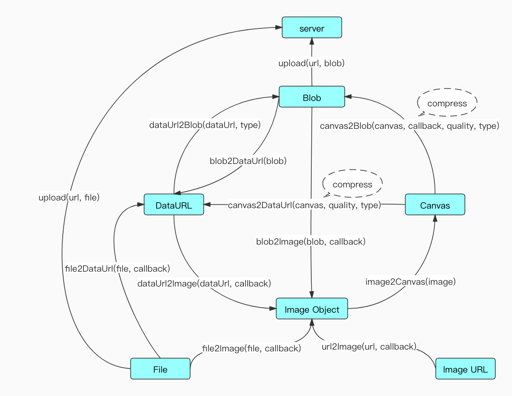

## Introduction

`js-image-compressor` is a `javascript` library that implements lightweight image compression. After compression, it is only `5kb`, and the image can be compressed on the front-end page. While providing basic image compression functions, it also exposes related public methods of image processing, as well as border case processing:

- A certain threshold can be set for the size of the converted image, so that the image converted to `png` format will not be too large under undesirable conditions, and at the same time larger than this threshold, it can be automatically converted to `jpeg` format for better compression;
- You can limit the width and height of the output image to prevent accidents, such as excessive compression operations that cause the browser to crash;
- By default, a transparent background color is added to the output image of `png`, and other formats are set to white to avoid "black screen";
- Read the `EXIF` information of `jpeg` format pictures, and correct the picture orientation;
- Provide some common tool functions for image processing (`image2Canvas`, `canvas2Blob` and `canvas2DataUrl`, etc.), and users can also customize the style features of image output (for example, grayscale processing, watermarking).

Document language:

- [English](./README.md)
- [Chinese](./README-CN.md)

## Use

### Installation and introduction

You can install dependencies through npm:

```js
npm install js-image-compressor --save-dev
```

You can also find the file `image-compress.min.js` in the `dist` directory after downloading and import it through `script` on the page:

```html
<script src="../dist/image-compressor.js"></script>
```

### Simple to use

You can only pass in the image object to be compressed, other parameters are optional, and the plug-in automatically completes the image compression processing according to the default parameters. However, the compressed image output in this way meets the following characteristics:

- The default configuration is based on `0.8` compression ratio;
- Output picture width/height maintains the source picture width/height;
- Generally, the output image format keeps the original image format;
- When the `size` of the `png` image is greater than `2m`, it will be converted into a `jpeg` format image by default;
- Fill the `png` picture with a transparent color;
- When the output picture `size` is larger than the source picture, the source picture will be returned as the output picture;
- `jpeg` format picture, correct the flip/rotation direction;

If these default configurations cannot meet your needs, other parameter configurations may be required. The following is a simple configuration:

```js
var options = {
  file: file,

  // Callback before compression
  beforeCompress: function (result) {
    console.log('Image size before compression:', result.size);
    console.log('mime type:', result.type);
  },

  // Compression success callback
  success: function (result) {
    console.log('result:', result)
    console.log('Image size after compression:', result.size);
    console.log('mime type:', result.type);
    console.log('Actual compression ratio:', ((file.size-result.size) / file.size * 100).toFixed(2) +'%');
  }
};

new ImageCompressor(options);
```

Among them, the hook function `beforeCompress` occurs after the image is read and before the canvas is created; the hook function `success` function occurs after the compression is completed to generate the image. Their callback parameter `result` is a `blob` object that integrates relevant information such as size, picture type and size.

### Standard use

In standard use, we can customize the compression ratio (`quality`), output image type (`mimeType`), width (`width`), height (`height`), and maximum width (`maxWidth`) according to our own needs. ), maximum height (`maxHeight`), minimum width (`minWidth`), maximum height (`minHeight`), png to jpeg threshold (`convertSize`), whether to correct the jpeg direction (`redressOrientation`) and whether the loose mode ( `loose`).

- Whether to correct the jpeg orientation (`redressOrientation`), the `jpeg` format image will be presented according to its orientation in some iOS browsers, this option can control the restoration of the initial orientation, the default is `true`;
- Whether it is loose mode (`loose`), which means to control when the compressed image `size` is larger than the source image, output the source image, otherwise output the compressed image, the default is `true`.

The following is the standard configuration:

```js
var options = {
  file: file,
  quality: 0.6,
  mimeType:'image/jpeg',
  maxWidth: 2000,
  maxHeight: 2000,
  width: 1000,
  height: 1000,
  minWidth: 500,
  minHeight: 500,
  convertSize: Infinity,
  loose: true,
  redressOrientation: true,

  // Callback before compression
  beforeCompress: function (result) {
    console.log('Image size before compression:', result.size);
    console.log('mime type:', result.type);
  },

  // Compression success callback
  success: function (result) {
    console.log('Image size after compression:', result.size);
    console.log('mime type:', result.type);
    console.log('Actual compression ratio:', ((file.size-result.size) / file.size * 100).toFixed(2) +'%');
  },

  // An error occurred
  error: function (msg) {
    console.error(msg);
  }
};

new ImageCompressor(options);
```

The `error` hook function is an error callback during the image compression process. Without this callback error, it will be thrown in the form of `throw new Error(msg)` in the plugin.

### Other hook functions

Before compressing the output image, we can also customize the canvas to incorporate elements.

The following is the grayscale and watermark processing of the picture:

```js
var options = {
  file: file,

  // Before picture painting
  beforeDraw: function (ctx) {
    vm.btnText ='Ready to draw...';
    console.log('Ready to draw...');
    ctx.filter ='grayscale(100%)';
  },

  // After the picture is painted
  afterDraw: function (ctx, canvas) {
    ctx.restore();
    vm.btnText ='Drawing completed...';
    console.log('Drawing completed...');
    ctx.fillStyle ='#fff';
    ctx.font = (canvas.width * 0.1) +'px microsoft yahei';
    ctx.fillText(vm.watermarkText, 10, canvas.height-20);
  },
};

new ImageCompressor(options);
```

`beforeDraw` is the hook function before the picture is drawn after the canvas is created, and `afterDraw` is the hook function after the picture is drawn.

### Tool functions

The following figure summarizes the detailed process of the `js-image-compressor` plug-in from uploading user pictures locally through the `file` of `input` to image compression, and at the same time exposes these tools and methods for users to use.

